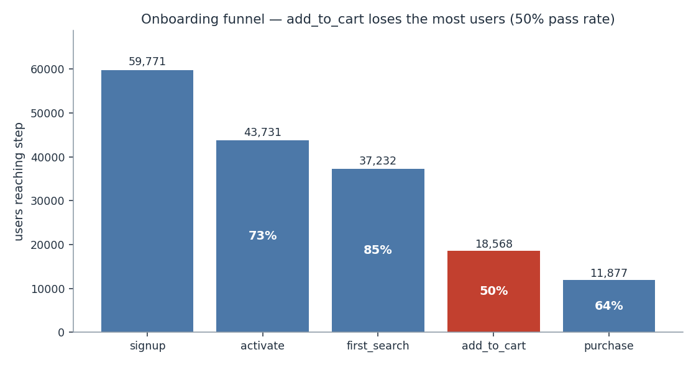
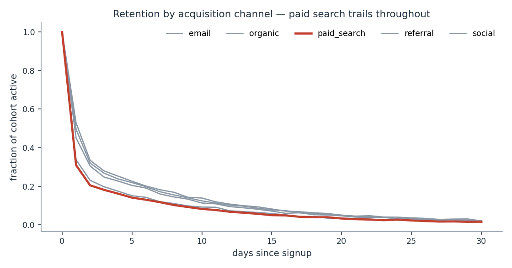

# Product Analytics Deep-Dive (SQL-First)

 [](https://riya0920.github.io/product-analytics-deepdive/) 

One stated business question, answered end-to-end in SQL over a DuckDB
warehouse, with data-quality tests that are proven to catch planted defects and a
decision memo that leads with the recommendation.

**[Browse the dbt lineage](https://riya0920.github.io/product-analytics-deepdive/)**


## The question

> **Where do we lose new users in week one, and what is it worth to fix?**

Fixed before any query was written. There is no exploratory chart wall here: EDA
without a decision is tourism. The answer is in **[docs/MEMO.md](docs/MEMO.md)**,
which is the artifact meant to be read first.

**Headline:** add-to-cart loses 18,664 users at a 49.9% pass rate - the outlier
in a funnel whose other steps convert at 73-85% - worth ~$50K at a 10% recovery
assumption. And paid search purchases at 5.9% vs organic's 29.8% (95% CI on the
difference: −24.7pp to −23.2pp).

## Run it

```bash
pip install -r requirements.txt
make generate    # build the event dataset
make build       # raw -> staging -> marts in DuckDB
make test        # SQL assertions + pytest
make analysis    # the numbers the memo quotes
make prove       # build WITHOUT cleaning; the tests must fail
make segments    # channel x platform x cohort, with the discipline that makes it safe
make incrementality  # can the causal question be answered? (no) and what would
make geo-design      # ...price the experiment that could
```

## dbt, for real

`dbt/` is a working dbt-duckdb project, not a description of one.

```bash
cd dbt && DBT_PROFILES_DIR=. dbt build      # 6 models, 34 tests
cd dbt && DBT_PROFILES_DIR=. dbt docs generate
```

```
Finished running 4 table models, 28 data tests, 2 view models
Done. PASS=34 WARN=0 ERROR=0 SKIP=0
```

The models are the **same SQL** as the hand-rolled runner, converted to
`ref()`/`source()` so there is one source of truth rather than two copies that
drift. What dbt adds over the runner:

* **Schema tests as declarations** - `unique`, `not_null`, `accepted_values`,
  and a `relationships` test asserting every session's `user_id` exists in
  `stg_users`. That referential check is the one the hand-rolled suite did not
  have.
* **Documentation next to the column it describes**, including the reasons - why dedupe uses the natural key, why attribution is first-touch, why
  `max_recoverable_revenue` is an upper bound.
* **Lineage**, generated into `target/manifest.json`, so the DAG is derived from
  the code rather than drawn by hand.

**Why dbt for a solo project?** Tests, lineage and docs are what make a pipeline
trustworthy to someone who did not write it - which is the whole point of a
portfolio piece. It is also the team standard, so using it is a statement about
team-readiness rather than tooling taste.

## Figures





Generated by `python -m analytics.charts` from the warehouse, never hand-drawn,
so they regenerate with the data and cannot silently disagree with the memo.

Three chart decisions worth defending: the funnel is a **bar chart, not the
tapering-trapezoid graphic** (which encodes the same number as both width and
area and makes small gaps look large); retention channels share **one axis**
rather than small multiples, because the gap between channels *is* the finding;
and there are **no dual axes** anywhere, since two y-scales let the author pick
the story by picking the scaling.

## Query performance: measured, and mostly a negative result

The spec asks for "a query performance note if you did something non-trivial".
The honest version requires measuring it, because the usual outcome of adding a
physical optimisation is that it does nothing and nobody checks.

Three layouts, same rows, same three queries the analysis actually runs, median
of five timings each:

| query | layout | median | speedup |
|---|---|---|---|
| sessionise | base | 0.365 s | 1.00x |
| sessionise | clustered | 0.361 s | 1.01x |
| funnel_counts | base | 0.041 s | 1.00x |
| funnel_counts | clustered | 0.042 s | 0.97x |
| funnel_counts | narrow projection | 0.043 s | 0.95x |
| one_day_slice | base | 0.118 s | 1.00x |
| one_day_slice | clustered | 0.099 s | 1.19x |

**On query time this is a negative result, and the run-to-run variation says so
plainly**: `funnel_counts` on the clustered layout measured 1.25x in one run and
0.97x in the next. A difference that changes sign between runs is noise, not a
speedup, and quoting the favourable run would have been the easiest possible way
to manufacture a result.

**Where the layouts do pay is storage**, measured as real ZSTD parquet bytes:

| layout | columns | parquet bytes | vs base |
|---|---|---|---|
| base | 8 | 5,387,080 | 1.000 |
| clustered by `(user_id, event_ts)` | 8 | 4,896,928 | **0.909** |
| narrow projection | 3 | 3,595,732 | **0.667** |

Sorting buys **9% smaller storage** because similar values cluster and compress
better; the projection buys **33%** by not storing columns the query never reads.

**Why the time result is not the whole story:** DuckDB is a vectorised in-process
engine reading from local memory, where scan cost is small and layout matters
little. On a distributed warehouse reading from object storage, bytes scanned
*is* the cost model - BigQuery bills for it directly - so a 33% byte reduction
that is invisible here would be a 33% cost reduction there. The measurement is
reported as what it is: evidence about DuckDB, not about every engine.

**A bug this measurement had first:** table sizes were read from
`duckdb_tables().estimated_size`, which is a **row-count estimate, not bytes**.
It reported all three layouts as identically sized - a number that looks like a
measurement and is not. Replaced with real parquet bytes on disk.

## Segmentation, and the discipline that makes it safe

`make segments`. Cutting 60,000 users by channel x platform x cohort-week produces
hundreds of cells, and two things then go wrong silently: **multiplicity** (one
cell in twenty looks significant with nothing going on) and **thin cells** (a
40-user cell has a retention interval fifteen points wide and is not evidence of
anything). Every cell here carries a Wilson interval, cells under 300 users are
excluded, and the exclusion count is printed so it is visible rather than quiet.

**Does the paid-search gap survive conditioning on platform?** Yes - and that
matters, because a gap that only appeared in aggregate would be a platform-mix
effect wearing a hat:

| platform | paid_search D7+ | organic D7+ | gap | 95% CI |
|---|---|---|---|---|
| all | | | −12.1 pp | [−13.0, −11.2] |
| android | 0.695 | 0.824 | −12.9 pp | [−14.4, −11.4] |
| ios | 0.712 | 0.825 | −11.3 pp | [−12.7, −9.9] |
| web | 0.704 | 0.826 | −12.2 pp | [−13.9, −10.5] |

Ten channel pairs were checked for a **Simpson reversal**; none found. Reported
even though it is a null, because a paradox check that only ever appears when it
fires is one nobody can calibrate.

### A trend that was not there

The first version of the cohort-over-cohort check fitted an **unweighted** slope
and compared its total drift to a fixed two-point threshold. It reported a
widening gap: −0.18 pp/week, −2.9 points over the window. The generator plants no
cohort trend at all. Fitting the slope by **weighted** least squares and testing
it against its own standard error gives z = −1.9 - not significant, and the
verdict flips to "standing quality difference, not a live regression". A magic
threshold on an unweighted slope is precisely the machinery that turns noise into
a roadmap item.

### What segmentation does to unvalidated data

This is the part worth the module. The generator plants an iOS timezone bug - events stamped in local time rather than UTC. Run the platform cut on both
warehouses:

| metric | clean iOS vs rest | uncleaned iOS vs rest | manufactured |
|---|---|---|---|
| `d1_exact` | −0.0 pp (ns) | **−4.7 pp (significant)** | −4.7 pp |
| `d7_plus` | +0.4 pp (ns) | +0.3 pp (ns) | −0.1 pp |

An eight-hour shift moves events across an exact-day boundary and invents a
multi-point platform deficit; on an unbounded metric a whole tail of later
activity absorbs it and the same bug is invisible. **Both numbers are correct.
Only one of them is a finding, and nothing in the segmented output says which.**
Segmentation on unvalidated data does not add noise - it adds confident, wrong
findings.

### Geography, and the decomposition that stops it becoming a bad recommendation

`make segments` now cuts by region too, and the regional number on its own is a
trap:

| region | n | D7+ | 95% CI |
|---|---|---|---|
| apac | 12,514 | 0.7862 | [0.779, 0.793] |
| amer | 27,373 | 0.7812 | [0.776, 0.786] |
| **emea** | 20,111 | **0.7667** | [0.761, 0.773] |

EMEA retains **1.9 points worse** than APAC, and the confidence intervals do not
overlap. Reported there, it reads as a product problem in EMEA.

It is not. A regional gap has two explanations with *opposite* responses - a different channel mix (a marketing fact) or a worse experience within the same
channel (a product fact) - and the headline number cannot tell them apart.
**Kitagawa decomposition** (Oaxaca - Blinder for rates) separates them:

    gap = Σ_c (w_A,c − w_B,c) · r̄_c        ← composition
        + Σ_c  w̄_c · (r_A,c − r_B,c)       ← rate

| component | points | |
|---|---|---|
| channel mix (composition) | **−2.44** | |
| within-channel (rate) | +0.49 ± 0.51 | **not significant** |
| residual from thin cells | +0.00 | |

Composition accounts for *more than the whole gap*; the within-channel term runs
the other way by half a point and is indistinguishable from zero. **Within the
same channel, EMEA and APAC are the same.** EMEA buys more paid search, and paid
search retains worse everywhere - which the memo already knew. A product
investigation into EMEA would be chasing a marketing fact.

The symmetric form is used deliberately: weighting composition by one region's
rates and rates by the other's weights gives a different answer depending on
which region you call the baseline, and there is no principled reason to prefer
either direction. A test asserts that reversing the pair just flips the signs.

**The generator plants no direct regional effect at all** - only a different
channel mix per region. So a correct decomposition *must* return a
non-significant rate term, and a test asserts exactly that. If the analysis ever
starts finding a regional effect, it has found a bug in itself.

### Does the headline survive being cut by everything else?

`make slice-check` takes a pooled comparison and re-runs it inside every slice of
the other columns. It is the strongest thing observational data supports: not
proof of *why*, but a check that the finding is not an artifact of composition.

Organic converts at **29.84%** against paid search at **5.88%**, a 5.08x gap. Cut
fifteen ways, it does not move:

| cut | slices | reversals | verdict |
|---|---|---|---|
| platform | 3 | 0 | ratios 4.67x to 5.29x |
| region | 3 | 0 | ratios 4.58x to 5.21x |
| platform x region | 9 | 0 | ratios 3.92x to 6.13x |

Every one of the fifteen was powered to detect a reversal, and the smallest cell
was 531 users. That is consistent with the effect living in the channel rather
than in the device or the region.

**The same tool run on a gap that is pure composition says so.** Pooled by region,
APAC converts at 22.65% and EMEA at 17.69%, and the confidence intervals do not
overlap. Condition on channel and it evaporates:

```
organic:      amer 29.94%   apac 29.46%   emea 30.06%
paid_search:  amer  5.74%   apac  6.44%   emea  5.84%
```

EMEA buys 29.1% paid search against APAC's 12.3%. The tool reports **COLLAPSES**
for that comparison and **HOLDS** for the channel one, which is the only reason
the second result is worth anything.

### Two ways this check turns into a rubber stamp, and what stops them

**Counting sign flips.** Cut finely enough and something flips from noise alone,
so a naive count grows with the number of slices rather than the evidence. A
reversal is only called real when the gap's interval excludes zero; a flip that
cannot be told from zero is printed as `flipped (n.s.)`.

**Counting silence as agreement.** This one was a real bug, caught by running the
tool against the composition case above. A slice that is powered and shows *no*
effect is evidence **against** the headline, and the first draft counted it as
agreement because it had not reversed. On a gap that was entirely composition it
printed `HOLDS in every powered slice`, which is precisely backwards. Powered
slices are now split into held and vanished, and vanished ones drive the verdict
toward `COLLAPSES`. `test_pure_composition_gap_is_reported_as_collapsing` pins it.

Slices too small to resolve an effect the size of the headline are marked
`underpowered` and are not counted as agreement either, because "no reversals"
across cells that could never have shown one is not evidence.

### Adding a column without moving a single existing number

Region is drawn from a **separate RNG stream**, seeded independently of the main
generator. That is not a stylistic choice: drawing it from the main stream would
consume values and shift every subsequent draw, silently changing the funnel
rates, the retention curves, and every figure the committed memo quotes - for a
column that is supposed to be purely additive.

The funnel after adding region is byte-identical to the funnel before it
(59,771 signups, 0.7316 activation, 0.4987 add-to-cart, 11,877 purchases), and a
test pins those exact values against the pre-existing figures rather than
trusting the argument.

## Incrementality: the question this data cannot answer, priced

`make incrementality`. The memo says paid search *retains* worse; it does not say
paid search *causes* worse retention. The observed gap is

    observed gap  =  causal effect of the channel  +  selection

and no amount of SQL over this table separates the terms, because the confounder
is user intent and nobody logs intent. So the module simulates the situation with
a **known** causal effect, runs what an analyst would actually run - raw
difference, g-computation, inverse-propensity weighting - and then does the thing
that is usually skipped: **validates the sensitivity analysis in a world where the
answer is known.**

|  | pure selection (τ=0) | real effect (τ=−0.55) |
|---|---|---|
| true risk difference | 0.0 | −10.7 pp |
| raw difference | −18.4 pp | −29.8 pp |
| adjusted (g-computation) | **−12.0 pp** | −23.3 pp |
| E-value | 1.69 | 2.32 |
| strength of everything measured, bundled | 1.65 | 1.89 |
| margin | **1.02x** | 1.23x |

### The negative result

The plan was that the E-value would separate the two worlds. **It does not.** In
the world where the true causal effect is *exactly zero*, adjustment still leaves
−12.0 points, and the E-value for that residual clears its benchmark. A rule of
"the E-value beats what we measured, therefore causal" calls pure selection
causal. Only the margin differs, and a margin with no sampling distribution is not
something to set a budget by.

Two smaller things fell out of building it:

* **The benchmark choice decides the answer.** The obvious comparison - the
  strongest single measured covariate - is too weak by construction, because a
  latent confounder is generally stronger than any individual noisy measurement of
  it. Bundling the measured covariates into fitted indices and comparing top
  quartile to bottom raises the benchmark from 1.28 to 1.65 and is the defensible
  version. Both are reported.
* **Adjustment removes about the same absolute bias in both worlds** (−0.12 in
  each), which is exactly why the adjusted point estimates cannot be told apart.

### So price the experiment instead

`make geo-design`. The unit of randomisation is a **geo**, because you cannot
switch ads off for one user, and that single fact costs almost all the power:

* 60 geos x 900 users/week = **54,000 users a week**, and that number is
  irrelevant. The effective sample size is **60**.
* Between-geo retention SD is ~4.5 points, which dominates the binomial noise
  inside a geo and sets the MDE.
* At 60 geos the study detects a **3.3 point** change. The 2.0 point target needs
  **159 geos** - or pre-period adjustment at **ρ ≥ 0.79**, solved rather than read
  off a table of round numbers, and itself an assumption to check.

And what it still cannot do: a holdout measures the effect of **turning paid
search off**, which is the decision-relevant quantity, not the effect of a
paid-search user being a paid-search user. Organic pickup means those differ.

## Grading the methods against a real experiment

Every other number in this repository comes from a generator I wrote, which means
I chose the answer before I measured it. `make lalonde` runs the same exercise on
data where somebody else chose the answer, by running an actual randomised trial
on actual people.

The National Supported Work Demonstration (LaLonde 1986; comparison groups from
Dehejia and Wahba 1999) randomly assigned unemployed men to a subsidised training
programme. Random assignment means the earnings difference **is** the causal
effect, no adjustment required.

**Ground truth: $1,794** (95% CI $479 to $3,109, 185 treated vs 260 control).

The same release ships two observational comparison groups pulled from national
surveys, PSID and CPS. Swapping the real control arm for one of them is exactly
what an analyst does when there is no experiment. So the setup grades itself.

### The naive answer is not merely wrong, it is confidently backwards

| comparison | estimate | verdict |
|---|---|---|
| randomised control (truth) | **+$1,794** | |
| vs PSID survey controls | **−$15,205** | wrong sign, off by $17,000 |
| vs CPS survey controls | **−$8,498** | wrong sign, off by $10,300 |

The PSID answer says a job training programme **destroyed fifteen thousand dollars
of annual earnings**, with a 95% interval of −$16,493 to −$13,917 that does not
come close to containing zero, let alone the truth. Precisely wrong is worse than
noisy, because nothing about the output invites a second look.

### The grader is checked against the case where it should succeed

Run against the *real* randomised control, every estimator lands on the truth:

| method | estimate | covers truth |
|---|---|---|
| naive difference | $1,794 | yes |
| OLS with covariates | $1,676 | yes |
| propensity matching | $2,562 | yes |
| IPW (trimmed) | $1,641 | yes |
| AIPW (doubly robust) | $1,619 | yes |

That has to pass before any result on PSID is worth reading, and
`test_harness_recovers_truth_on_the_experimental_control` pins it. The OLS figure
of $1,676 is also the published Dehejia and Wahba regression estimate, which is a
second, external check on the implementation.

### The result worth arguing about

Against the PSID controls, the methods disagree with each other, and **the
sophisticated ones lose**:

| method | estimate | bias | sign |
|---|---|---|---|
| naive difference | −$15,205 | −$16,999 | WRONG |
| OLS with covariates | $752 | −$1,042 | ok |
| **propensity matching** | **$2,697** | **+$903** | **ok, covers truth** |
| IPW (trimmed) | −$1,887 | −$3,681 | **WRONG** |
| AIPW (doubly robust) | −$1,185 | −$2,979 | **WRONG** |

**The doubly robust estimator gets the sign wrong.** It is the one with two
chances to be right, it is the one a methods section would describe as the safe
choice, and on this data it concludes the programme cost people money. Plain
one-to-one matching, which is the least clever thing in the table, is the only
method that both recovers the truth and covers it.

### Overlap said so in advance

The diagnostic that explains it runs before any estimate:

| control group | covariates imbalanced | worst | controls reaching the lowest treated propensity |
|---|---|---|---|
| randomised control | 4 of 8 | −0.30 SD | 95.8% |
| PSID | **8 of 8** | **−1.84 SD** | **44.1%** |
| CPS | 7 of 8 | +2.43 SD | 35.4% |

Fewer than half the PSID controls are even as likely to be treated as the least
likely treated man. Weighting cannot fix that, because the weights are being
asked to stand in for people who are not in the data. Matching survives precisely
because it **discards** the unmatchable instead of reweighting them, which is why
the module reports `unmatched_treated` alongside every matched estimate: a
matched number without it has quietly changed which population it is about.

The transferable rule is that **overlap is a precondition, not a diagnostic to
run afterwards**. Every method in that table is correct given its assumptions.
The assumption that fails is the one nobody writes down.

## Difference-in-differences, and the assumption it rests on

`make did` grades two-way fixed-effects DiD against a **planted** treatment
effect (tau = 3.0) on a synthetic panel, the same plant-then-score discipline as
the modules above. DiD's whole claim is **parallel trends**: absent treatment the
treated and control groups would have moved together, so the control change is a
valid counterfactual. The module runs it twice:

| scenario | TWFE DiD estimate | bias | 95% CI covers tau | placebo pre-trend |
| --- | --- | --- | --- | --- |
| parallel trends holds | +3.08 (se 0.14) | +0.08 | yes | +0.11 |
| parallel trends violated | +5.48 (se 0.14) | +2.48 | no | +1.31 |

When the assumption holds, DiD recovers tau and a **placebo DiD on the
pre-period** (where nobody is treated yet, so the true effect is zero) finds
nothing. When the treated group was already on a different trajectory before
treatment, DiD is biased by the trend gap, and the placebo pre-trend is
non-zero, which is the diagnostic that should stop you trusting the estimate. The
estimator is OLS with unit and period fixed effects and **cluster-robust standard
errors by unit** (the DiD error is correlated within a unit over time). The
biased row is reported as-is rather than tuned away, because the point is that the
method fails loudly, not that it always works.

## Instrumental variables, and the two assumptions it rests on

`make iv` grades two-stage least squares against a **planted** effect (beta = 2.0)
when an **unobserved confounder** drives both the treatment and the outcome, the
case OLS cannot handle. An instrument Z moves the treatment but (if valid) affects
the outcome only through it, so 2SLS uses the confounder-free part of the
variation.

| scenario | first-stage F | OLS estimate (bias) | 2SLS estimate (bias) | 2SLS CI covers beta |
| --- | --- | --- | --- | --- |
| strong, valid instrument | 1184 | +2.53 (+0.53) | +1.97 (−0.03) | yes |
| weak instrument | 1.8 | +2.70 (+0.70) | +1.23 (se **1.23**) | N/A, unreliable |
| exclusion restriction violated | 1184 | +2.88 (+0.88) | +3.49 (**+1.49**) | no |

OLS is biased by the confounder in every row. With a strong valid instrument 2SLS
recovers beta. IV has **two** failure modes and both are shown: a **weak
instrument** (first-stage F below the Staiger–Stock threshold of 10) makes 2SLS
high-variance and untrustworthy: the F=1.8 diagnostic is the tell; and a
**violated exclusion restriction** (Z affects the outcome directly) biases 2SLS
by the direct path *even though the first-stage F still looks strong*, a
reminder that the F-test checks relevance, not validity. The biased rows are
reported as-is.

## Cloud (GCP) pipeline

The same `data/events.parquet` also feeds a cloud-native ELT path
([`cloud/README.md`](cloud/README.md)): raw daily event files land in Cloud
Storage, a **Cloud Function** aggregates them with the pure `cloud/transform.py`
(380,798 events → 8,846 daily-metric rows), and they load into a partitioned,
clustered **BigQuery** table, driven by a **Cloud Scheduler** daily job. The
`infra/` Terraform provisions the bucket, dataset/table, both functions,
scheduler, and a least-privilege service account; IAM and cost (Always-Free, $0)
are documented. The transform is unit-tested on the real events and the function
path is tested with GCS/BigQuery mocked (`pytest cloud/tests`). Deploying to a
live project needs your GCP auth; the commands are in `cloud/README.md`.

## The pipeline

```
data/events.parquet          380,798 events, 59,998 users, 120 days
  -> sql/staging/stg_events  dedupe, timezone fix, null-id exclusion
  -> sql/staging/stg_users   one row per user, first-touch attribution
  -> sql/marts/mart_sessions 30-minute-gap sessionisation (LAG + running SUM)
  -> sql/marts/mart_funnel   per-step conversion, users lost, revenue at risk
  -> sql/marts/mart_retention D1/D7/D30 by cohort and channel
  -> sql/marts/audit_data_quality  what cleaning removed, quantified
```

Models are plain `.sql` files with a declared dependency order, run by a ~100-line
runner. Tests are `.sql` files that must return **zero rows** - dbt's contract,
implemented small enough that the SQL stays the artifact rather than the tool
configuration.

## The SQL worth reading

**Sessionisation** (`mart_sessions.sql`) - the canonical live-round exercise:
`LAG` for the previous event, a boolean for gap-exceeded, then a running `SUM`
over that boolean to allocate session ids.

**Funnel** (`mart_funnel.sql`) - `LAG` for the previous step's population,
`FIRST_VALUE` for cumulative conversion, drop-off quantified in users *and*
dollars.

**Retention** (`mart_retention.sql`) - emits both `dN_exact` and `dN_plus`,
because those two definitions disagree and papering over that is how retention
numbers stop being comparable between teams. `COUNT(DISTINCT user_id)` inside the
day filter is what stops a user active three times on day 7 counting three times,
and an assertion test enforces that retention never exceeds cohort size.

## The tests have teeth, and it's proven

Three defects are planted in the generator on purpose. `make prove` builds
staging **without** the fixes and the suite must fail:

```
$ make prove
FAIL assert_no_duplicate_events        4851 offending row(s)
FAIL assert_no_null_user_ids           1 offending row(s)
FAIL assert_no_platform_hour_skew      ('ios','web', 4.92, 12.94, 8.02)
3 test(s) failed on uncleaned data, as they must. The tests have teeth.
```

**Two of these were harder than they look:**

*Duplicates* are deduplicated on `(user_id, event_name, event_ts)` and **not** on
`event_id` - retried client beacons carry a fresh request id, so a surrogate-key
dedupe finds nothing and leaves every count inflated. The dedupe recovers the
planted rate: 1.48% measured against 1.5% planted.

*The timezone bug* passes every ordering assertion, because a uniform per-platform
shift preserves event order - signup is still first, the funnel is still
monotonic - while every cohort-day boundary is silently wrong. It is only visible
in the **distribution**, and only under a **circular** mean: hour-of-day wraps at
midnight, and with an evening-peaked traffic profile the arithmetic means differ
by just 2.4 hours, which hides under any sensible threshold. The circular mean
recovers the true separation exactly: **8.02 hours**.

## Ground truth is recoverable - that's what validates the pipeline

The generator's true step rates are known, so the pipeline can be checked rather
than trusted. `test_funnel_recovers_the_true_step_rates_within_each_channel`
asserts every channel/step transition lands within 0.025 of
`true_rate x channel_multiplier`.

That test is checked **per channel, and the reason is a finding in itself.** The
pooled funnel does *not* equal `true_rate x average_multiplier`: each step
selects on survival, so users still in the funnel at add-to-cart are
disproportionately from high-quality channels and the effective mix drifts upward
step by step. Pooled add-to-cart measures 0.499 against a naive 0.468 prediction - that 3-point gap is survivorship, not error. Within a single channel there is
no mix to drift, and the generator's rate comes back exactly.

## Two analysis bugs this project found and fixed

1. **Right-censoring.** The first version reported 0.7% D30 retention. A user who
   signed up three days before the data ends cannot have a D7 event, and leaving
   their cohort in the denominator manufactures a decline that is purely an
   artefact of the window. Each horizon now gets its own eligible cohort set.
2. **A degenerate retention curve.** The generator's original pure-exponential
   return hazard drove 30-day retention to nearly zero, so the D30 number was a
   property of the generator rather than of anything worth analysing. Real
   retention curves flatten because a minority of users form a habit; the
   generator now has a loyal segment and D30+ lands at a realistic 22-25%.

Both are in the git history rather than quietly corrected, because the second one
in particular would have made the memo size a fake problem.

## Known limitations

Things this repository does not prove, and what each one would need.

| limitation | why |
|---|---|
| **BigQuery variant (bytes-scanned is the cost model there)** | not possible here: no BigQuery |
| **Actually running the geo holdout** | not possible here: it needs a live ad account |

## Honesty notes

* **The incrementality module's world is not this warehouse.** It is a separate
  simulation with a known `tau`, because the warehouse's channel effect is baked
  in as a user property and therefore has no causal contrast to recover. What
  transfers is the method and the negative result, not the numbers.
* **The E-value validation is a single pair of worlds**, not a coverage study
  across a grid of confounding strengths. It is enough to show the decision rule
  fails; it is not enough to characterise *when*.
* **`geo_holdout_design` takes the between-geo SD as an input.** There are no geos
  in this dataset to measure it from, so 4.5 points is an assumption stated as an
  argument, not a measurement. Every number downstream of it moves if it is wrong.
* Data is **simulated**. Dollar magnitudes are meaningful only relative to other
  figures in this dataset and are not real-world claims.
* The memo's dollar figures are **upper bounds** and say so, with the largest
  source of optimism (recovered users assumed to convert like users who already
  passed) named explicitly.
* No causal claim is made anywhere. The recommendation ends by proposing the A/B
  test that would actually establish one, sized against the observed baseline.
